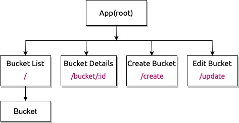

# Bucketlist :heartbeat:

#### A personal bucketlist with CRUD functionality, Lastest updated : 5/13/2020

#### Jiwon Han and Jieun Kang

## 1. User Flow

This is a site that a user is able to manage their bucketlists. 

1. A user is able to navigate to Home and Add page through nav bar.
2. A user is able to create, update and delete buckets aka wishes. All buckets are stored in the Cosmos database.
3. A user is able to see bucket's detail by clicking a specific bucket in the list.

### Diagram



### Database

```bash 
|-- bucketlist
|   |-- id
|   |-- title
|   |-- summary
|   |-- targetDate
|   |-- timestamp
```

<!-- ### Sreenshot

1. Main Page


2. Create Page


3. Survey Page 


4. Survey Result Page


5. Survey Result Page
 -->

### What's Included

```bash 
|-- actions 
|   |-- actions.jsx
|   |-- bucketActions.jsx
|   |-- fetchData.jsx
|-- components :
|   |-- App.jsx
|   |   |-- Header/Main/Footer
|   |-- App.css
|   |-- Bucket.jsx
|   |-- BucketDetails.jsx
|   |-- CreateBucket.jsx
|   |-- Edit.jsx
|   |-- Footer.jsx
|   |-- Nav.jsx
|-- middleware :
|   |-- middleware-logger.jsx
|-- reducers :
|   |   |-- reducer.js
|-- history.js
|-- index.jsx
```

## 2. Development

### Tech stack:

+ [NPM](https://www.npmjs.com/) for package management
+ [react](https://reactjs.org/), [react-redux](https://react-redux.js.org/) as core stack
+ [Azure functions](https://azure.microsoft.com/en-us/services/functions/?&ef_id=CjwKCAjwkun1BRAIEiwA2mJRWTnECYvz_9H5LYcwGeD4xYNMsMLUJMVdNABo2YQzlaZIEWyizWOu9RoCXqIQAvD_BwE:G:s&OCID=AID2000128_SEM_CjwKCAjwkun1BRAIEiwA2mJRWTnECYvz_9H5LYcwGeD4xYNMsMLUJMVdNABo2YQzlaZIEWyizWOu9RoCXqIQAvD_BwE:G:s&gclid=CjwKCAjwkun1BRAIEiwA2mJRWTnECYvz_9H5LYcwGeD4xYNMsMLUJMVdNABo2YQzlaZIEWyizWOu9RoCXqIQAvD_BwE) for serverless compute
+ [Cosmos Db](https://docs.microsoft.com/en-us/azure/cosmos-db/introduction) for database
+ [drawio](https://app.diagrams.net/) for diagram
+ [favicon](https://www.favicon-generator.org/) 

### To run dev mode locally:

```bash
  $ git clone https://github.com/jiwon-seattle/Bucketlist-react-redux.git
  $ cd into bucketlist
  $ npm install  
  # After successfull pkg installtion
  $ npm start
```
Now, it will automatically open http://localhost:3000 and show you bucketlist site.

### Packages used

`react` `react-redux` `react-bootstrap` `react-dom` `react-router-dom` `react-scripts` `redux` `redux-thunk` `axios`

## 3. Known Bugs

There are no known bug at this moment

## 4. Support and contact details

Any feedback is appreciated! Please contact at email: jiwon1.han@gmail.com or jieunkang101@gmail.com

### License

*This software is licensed under the MIT license*

Copyright (c) 2020 **_Jiwon Han and Jieun Kang_**


